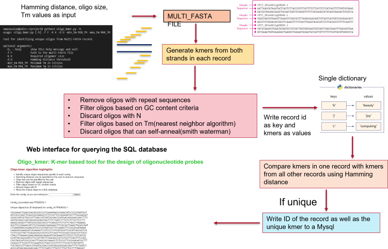

# oligo_kmer tool

The rapid detection of pathogenic microbes is crucial for biosurveillance, disease diagnostics, and epidemiological studies. Oligonucleotide-based hybridization methods provide cost-effective and highly specific detection even at the strain level.

The oligo_kmer tool is designed to build a database of unique oligonucleotides for pathogens, which can be used for designing hybridization chips for the rapid identification of pathogens.

## Features

- **Customization in Oligo Design**: Users can specify their own parameters for oligo design accprding to the chip design needs including oligo size, Hamming distance threshold, and melting temperature range.

- **Handles Large Oligo Sizes**: The tool has been optimized to handle large oligo sizes.

- **SQL Database Storage**: Oligo data is stored in a MySQL database, facilitating global collaborative efforts.

- **GUI Interface**: A GUI interface is provided for easy data retrieval from the SQL database, enhancing broader user accessibility.

## Flow Chart of the script

1. **Parse command line arguments**: The script takes in five command line this include multi-FASTA file path, the desired kmer size, the Hamming distance threshold, and Tm range.

2. **Generate Kmers followed by filteration**: For each sequence in the multi-FASTA file, the script generates all the possible kmers from both the forward and reverse strand. These kmers then pass through a series of filters mentioned below 
    - Kmers containing 'N' are ignored.
    - Kmers with a stretch of 5 or more repeating nucleotides are discarded.
    - Kmers with a GC content below 40% or above 60% are discarded.
    - Kmers with a Tm outside the user-specified range are discarded.
    - Kmers with self-complementarity (above 80% identity score) are discarded.

3. **Identify Unique Kmers**: The script then iterates over the kmers of each sequence, comparing each kmer to the kmers of all other sequences. If the Hamming distance between the kmer and all other kmers is greater than the threshold, the kmer is considered unique. These unique kmers are then stored in the MySQL database, with their respective sequence IDs. These kmers/oliogs can then be accessed using web page by providing the respective FASTA record ID ( use the provide PHP script)




## How to Use

### Usage of oligo_kmer.py 

Please note: Before running the script, edit the MySQL database parameters in the code to match your database configuration.

To run the `Oligo_kmer` python script, you will need to provide the following arguments. 

- `-f`: Path to multi-FASTA file.
- `-k`: Required oligomer size.
- `-d`: Hamming distance threshold.
- `-min_tm`: Minimum Tm in Celsius.
- `-max_tm`: Maximum Tm in Celsius.

A small fasta file(mini.fasta) is provided for testing the script. You can get the mini.fasta from: https://github.com/sujith-manavalan/oligo_kmer/blob/main/mini.fasta

Example useage:

```bash
python oligo_kmer.py -f /path/to/your/file.fasta -k 25 -d 5 -min_tm 50 -max_tm 60
```
To run the script with real dataset use the complete viral refseqgenome which can be found from https://ftp.ncbi.nlm.nih.gov/refseq/release/viral/

Please note : if using bacterial genomes make sure to remove plasmid sequences from the genome

### Usage of retrieve_oliog_kmer.php

Along with the Python script `oligo_kmer.py`, there is a  PHP script `retrieve_oligo_kmer.php`. This script provides a GUI interface for accessing the oligonucleotides stored in the SQL database.

To use the PHP script, navigate to the location of the `retrieve_oligo_kmer.php` script in your web browser. 

To retrieve oligonucleotides for a specific contig, enter the contig ID into the form and press submit(only 20 unique oligonucleotides will be displyed). 

The script will then connect to the SQL database, retrieve up to 20 unique kmers associated with that contig ID, and display them on the web page.

Please note: The database connection parameters in the PHP script (server, username, password, database) must be edited to match your own MySQL database setup before using the script.

## Future developments

I welcome any suggestions/contributions for improvement of the code . I am hoping to further optimize the code for larger datasets, add multi-threading feature as well as additional customization options.
